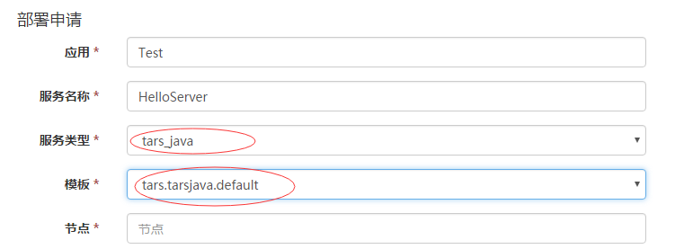
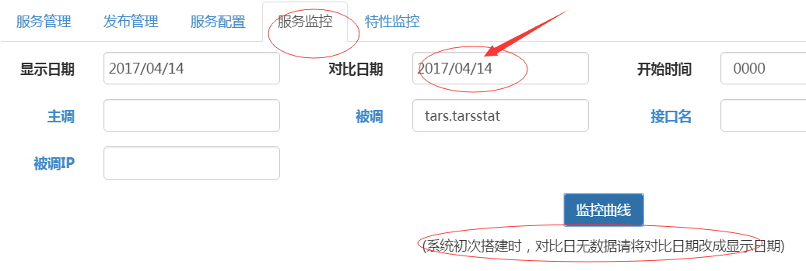

# 安装常见问题

### 1. 部署ip不能为`127.0.0.1`，原因如下：

1. 每个服务一般都有一个或者多个对外服务的obj，obj要对外提供访问，不能用 `127.0.0.1`;
2. 每个服务都有一个管理的obj，它使用的ip是`127.0.0.1`，端口和obj的端口一样;

### 2. Tars主要包括rpc开发框架、框架基础服务、web管理系统。

其中，rpc开发框架支持c++, java, php, go, nodejs，都有自己的基础库、idl代码生成工具、客户端和服务端实现，互不依赖。

且都可以运行在linux/mac/windows

### 3. Tars依赖的软件或者工具，在部署Tars时，必须事先安装好，参见 [手动安装](https://github.com/TarsCloud/TarsDocs/blob/master/installation/source.md).

### 4. Tars部署安装步骤要按 [手动安装](https://github.com/TarsCloud/TarsDocs/blob/master/installation/source.md) 文档先后顺序进行。

### 5. 执行tars\_start.sh脚本后，需要确定一下tars核心基础服务的进程是否是活的

可以使用命令:`ps -ef|grep tars`，看看 tarsregistry、tarsAdminRegistry、tarsnode、tarsconfig、tarspatch进程是否存在

### 6. 服务部署的相关路径，如下

服务打的日志路径在 `/usr/local/app/tars/app_log/${服务的应用名}/${服务的服务名}/` 目录下，例如:

```text
/usr/local/app/tars/app_log/Test/HelloServer/
```

服务的可执行文件在 `/usr/local/app/tars/tarsnode/data/${服务的应用名}.${服务的服务名}/bin/` 下,例如:

```text
/usr/local/app/tars/tarsnode/data/Test.HelloServer/bin/
```

服务的模版配置文件在 `/usr/local/app/tars/tarsnode/data/${服务的应用名}.${服务的服务名}/conf/` 下, 例如:

```text
/usr/local/app/tars/tarsnode/data/Test.HelloServer/conf/
```

服务的缓存信息文件在 `/usr/local/app/tars/tarsnode/data/${服务的应用名}.${服务的服务名}/data/` 下,例如:

```text
/usr/local/app/tars/tarsnode/data/Test.HelloServer/data/
```

### 7. 查看日志的方法

例如：

`/usr/local/app/tars/app_log/Test/HelloServer/` 目录下会有 `Test.HelloServer.log` , 发布失败的话，可以看看里面有什么错误日志，其日志级别为ERROR。

### 8. java的服务部署时，模版配置要选择 `tars.tarsjava.default`



### 9. 服务监控数据展示问题，注意查询条件



### 10. 老版本升级到支持IPv6版本\(v1.6.0及以上\)，数据库升级方法

执行以下数据库升级脚本，注意保证数据库密码正确性

```text
TarsFramework/sql/upgrade2IPv6.sh
```

## 11. tarsnode can not run java server: cannot execute java

安装jdk以后重启tarsnode

```
/usr/local/app/tars/tarsnode/util/start.sh
```

